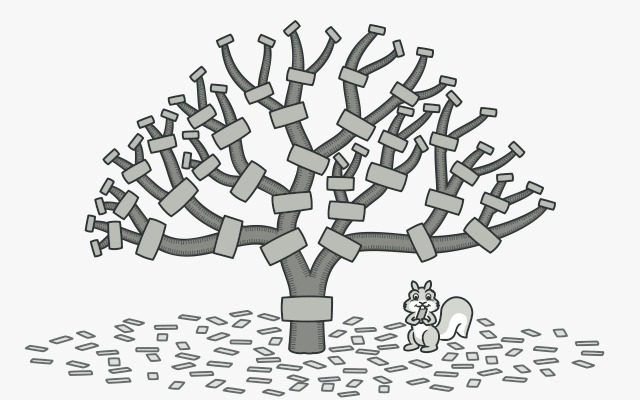

## Integrantes
- Juan de Dios Fernando Lerzundi Ríos
- José Daniel Zapata Anco
- Omar Baldomero Vite Allca
- Daniel Ureta Espinal
***
# Patrones de Diseño
***
**Problema: Gestión de Listas de Reproducción**
Supongamos que estás desarrollando un reproductor de música y necesitas una solución para gestionar las listas de reproducción de canciones con funcionalidades adicionales. Cada canción tiene un título y un artista, y deseas agregar las siguientes funcionalidades:

- Conteo de Reproducciones: Debes llevar un registro del número de veces que se ha reproducido cada canción en la lista de reproducción.

- Etiquetas de Género: Deseas poder asociar etiquetas de género a ciertas canciones y mostrarlas cuando se reproduce una canción.

- Lista de reproducción: Se necesita poder crear listas de reproducción que pueden contener tanto canciones individuales como otras listas de reproducción. 

- Ordenación de Canciones: Los usuarios deben poder ordenar las canciones en una lista de reproducción por artista o título según sus preferencias.

**Solución**
Vamos a desarrollar una aplicación elemental en `Ruby` con la finalidad de dar solución a esta problemática. Primero creamos la clase `Cancion`
```Ruby
class Cancion
  attr_accessor :titulo, :artista

  def initialize(titulo, artista)
    @titulo = titulo
    @artista = artista
  end

  def reproducir
    puts "Reproduciendo '#{titulo}' de '#{artista}'."
  end
end
```
Esta clase recibe como parámetros un título y un artista, también tiene un método que reproduce la canción especificada. En las siguientes clases implementaremos patrones de diseño como `Decorator`, `Composite` y `Strategy` para resolver problemas comunes en este tipo de programas
***
## Patrón Decorator
El patrón Decorator se utiliza para agregar funcionalidades adicionales a los objetos de nuestra clase `Cancion` sin modificar su estructura original.
Primero, crearemos una clase decoradora base que se encargará de "envolver" el objeto original.
<p align="center">
  
</p>

### Clase Base Decoradora

```Ruby
class CancionDecorator
  attr_reader :cancion
  
  def initialize(cancion)
    @cancion = cancion
  end
  
  def reproducir
    @cancion.reproducir
  end
end
```

Ahora, creamos decoradores específicos para las funcionalidades.

### Conteo de Reproducciones

Para contar las veces que se ha reproducido cada canción, implementamos un decorador específico.

```Ruby
class ContadorDeReproducciones < CancionDecorator
  def initialize(cancion)
    super(cancion)
    @reproducciones = 0
  end
  
  def reproducir
    @reproducciones += 1
    puts "Reproducciones: #{@reproducciones}"
    super
  end
end
```

### Etiquetas de Género

Para añadir etiquetas de género a las canciones, usamos otro decorador específico.

```Ruby
class EtiquetadorDeGenero < CancionDecorator
  def initialize(cancion, genero)
    super(cancion)
    @genero = genero
  end
  
  def reproducir
    puts "Género: #{@genero}"
    super
  end
end
```

### Uso del Decorator

Utilizamos los decoradores para extender la funcionalidad de una instancia de la clase `Cancion`.
Creamos objetos de diferentes clases relacionadas con la manipulación y seguimiento de canciones, y luego se llama a un método reproducir en uno de esos objetos.

```Ruby
cancion_decorator = Cancion.new("Imagine", "John Lennon")

cancion_con_contador = ContadorDeReproducciones.new(cancion_decorator)
cancion_con_etiquetas = EtiquetadorDeGenero.new(cancion_con_contador, "Rock")

3.times { cancion_con_etiquetas.reproducir }   #ejecuta la función 3 veces

# Salida esperada:
# Género: Rock
# Reproducciones: 1
# Reproduciendo 'Imagine' de 'John Lennon'.
# Género: Rock
# Reproducciones: 2
# Reproduciendo 'Imagine' de 'John Lennon'.
# Género: Rock
# Reproducciones: 3
# Reproduciendo 'Imagine' de 'John Lennon'.
```


## Patrón Composite
El uso del patrón Composite nos permite componer objetos en estructuras de árbol y trabajar con esas estructuras como si fueran objetos individuales, en este caso vamos a 
tratar tanto las listas de reproducción como las canciones individuales de manera uniforme al llamar al método reproducir en la lista de reproducción principal, 
lo que a su vez reproduce todas las canciones o listas de reproducción que contiene, si esque las hay.
<p align="center"></p>

```Ruby
 class ListaReproduccion
    attr_accessor :nombre
    def initialize(nombre)
      @nombre = nombre
      @elementos = []
    end
  
    def agregar(elemento)
      @elementos << elemento
    end
  
    def reproducir
      puts "Reproduciendo lista de reproducción: #{@nombre}"
      @elementos.each(&:reproducir)
    end
  end
```

## Patrón Strategy

Strategy es un patrón de diseño de comportamiento que te permite definir una familia de algoritmos, colocar cada uno de ellos en una clase separada y hacer sus objetos intercambiables. (en este caso, `OrdenarPorArtista` y `ordenarPorTitulo`) sean intercambiables sin cambiar el código que las utiliza. Esto es útil cuando se quiere cambiar la forma en que se ordena una colección de objetos en tiempo de ejecución sin modificar el código existente.

<p align="center"></p>

```Ruby
 class EstrategiaOrdenar
    def ordenar(canciones)
      raise NotImplementedError, "Debes implementar el método 'ordenar' en la estrategia concreta."
    end
  end
  
  class OrdenarPorArtista < EstrategiaOrdenar
    def ordenar(canciones)
      canciones.sort_by! { |c| c.artista }
    end
  end
  
  class OrdenarPorTitulo < EstrategiaOrdenar
    def ordenar(canciones)
      canciones.sort_by! { |c| c.titulo }
    end
  end
```
